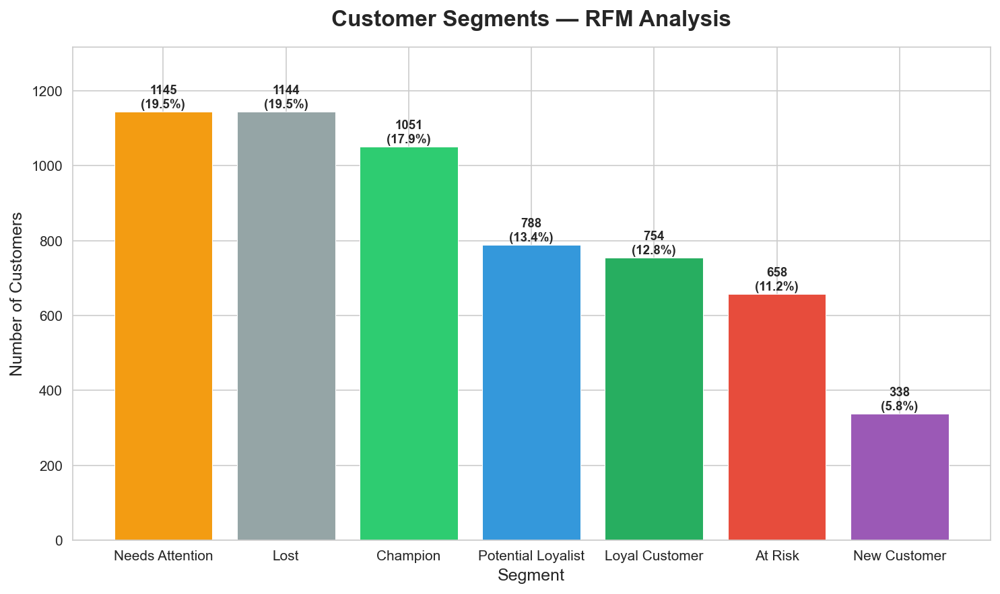
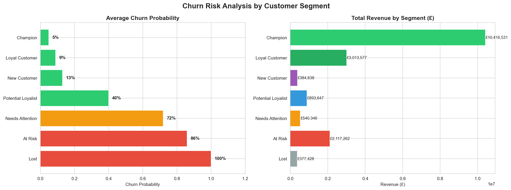
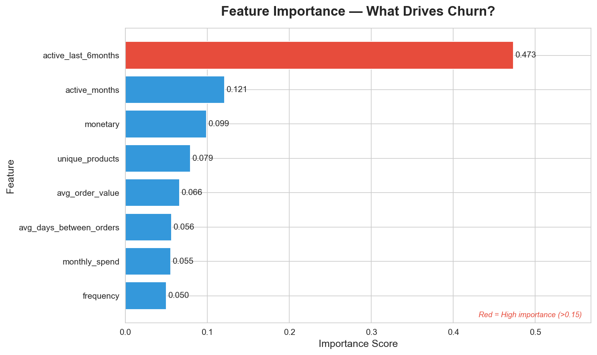

# clv-churn-prediction
CLV &amp; Churn Prediction | Python · SQL · Scikit-learn Analyzed 1M+ e-commerce transactions to segment 5,878 customers using RFM analysis and predict churn with a Random Forest model (AUC 0.9454). Identified 490 at-risk customers representing £2.1M in revenue exposure across 7 behavioral segments.

# Customer Lifetime Value & Churn Prediction
**Tech Stack:** Python, Pandas, SQL (SQLite), Scikit-learn, Matplotlib

## Project Overview
End-to-end machine learning pipeline analyzing 1M+ e-commerce transactions 
from UCI Online Retail II dataset to predict customer churn and identify 
high-value customer segments for targeted retention campaigns.

## Key Findings
- **5,878 unique customers** segmented into 7 behavioral groups using RFM analysis
- **Champion customers** (17.9% of base) drive **58.7% of total revenue** (£10.4M)
- **490 At-Risk customers** represent **£2.1M in revenue** at risk of churn
- Random Forest model achieved **AUC of 0.9454** for churn prediction
- **Recent activity (last 6 months)** identified as dominant churn predictor 
  with importance score of 0.473

## Business Recommendations
| Segment | Customers | Revenue | Action |
|---|---|---|---|
| At Risk | 658 | £2.1M | Immediate retention campaign |
| Needs Attention | 1,145 | £540k | Re-engagement emails |
| Champion | 1,051 | £10.4M | Loyalty rewards program |
| Lost | 1,144 | £377k | Low priority — let go |

## Project Structure
- **Phase 1:** Data loading and cleaning (805k rows after cleaning)
- **Phase 2:** SQL feature engineering (RFM + time-based features)
- **Phase 3:** Exploratory Data Analysis
- **Phase 4:** RFM Scoring and Customer Segmentation
- **Phase 5:** Churn Prediction ML Model
- **Phase 6:** Business Insights and Recommendations

## Visual Highlights

### Customer Segments

### Churn Risk Analysis

### Feature Importance

## Model Performance
| Model | AUC Score | Accuracy |
|---|---|---|
| Logistic Regression | 0.9312 | 91% |
| Random Forest | 0.9454 | 89% |

## How to Run
1. Download dataset from [UCI ML Repository](https://archive.ics.uci.edu/dataset/502/online+retail+ii)
2. Install dependencies: `pip install pandas numpy matplotlib seaborn scikit-learn`
3. Run `project-test.ipynb` in Jupyter Notebook
